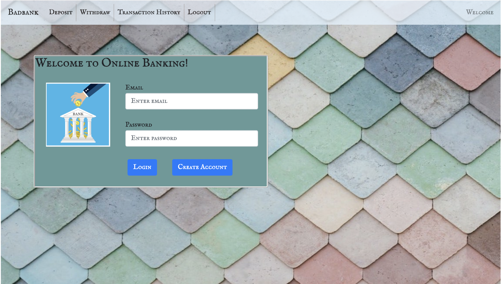

# Bad banking project

Bad bank is a basic application for banking customers to login to their secure account and check their balances, deposit fund, withdraw fund and see transaction history.

## User Story

As a bank customer, I want to be able to check my balance and transaction history online and deposit and withdraw money from my account online.

## Table of Contents

- [Installation](#installation)
- [License](#license)

## Tools Used

- HTML
- CSS
- Javascript
- React
- Express
- Node.js
- MongoDB Atlas
- axios
- Boostrap

## User Criteria

GIVEN The glass is desktop or mobile,

WHEN The user interacts with application,
THEN The pages are responsive,

GIVEN The user lands on the login page,

If user doesn't have any account, he/she can create an account.

THEN User will be able to login or sign up to login to application.

WHEN The user login,
THEN The user will be redirected to deposit page.

WHEN User enters amount of money and click deposit,
THEN user will see the deposit adds into the balance

WHEN User click withdraw,
THEN User will be redirected to withraw page and will be able to withdraw money

WHEN User click Transcation link,
THEN User will be able to see all his/her transactions since the opening of the account

WHEN User click logout,
THEN User will be logged out from the system and land on login page

## Installation

1. Clone the repository.
2. npm install in the terminal to install all dependencies for application.
3. npm start to start the application locally.
4. The application should now be running on http://localhost:3000.

## Deployment (Heroku)

[https://badbankproject.herokuapp.com/]

## Git Repository (GitHub)

[https://github.com/Zulaadmb/bad_bank_project]

## License

This project is licensed under MIT license.
